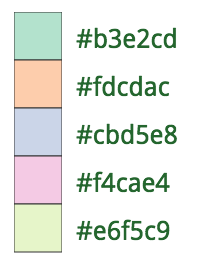

# five-color-map

Color a GeoJSON FeatureCollection so that contiguous areas have different fills.

## install

```
npm install --save five-color-map
```

## command line

install with [npm](https://www.npmjs.com/):
```
$ npm install -g five-color-map
```
then
```
$ five-color-map data.geojson > colored-data.geojson
```

## usage

``` javascript
var fiveColorMap = require('five-color-map');
var coloredGeoJSON = fiveColorMap(geojson);
```

Each feature in `coloredGeoJSON.features` now has a property `fill` with one of five values:



## caveat

At least one of your features must have less than 5 neighbors with adjacent sides. This won't work with a map of hexagons.
